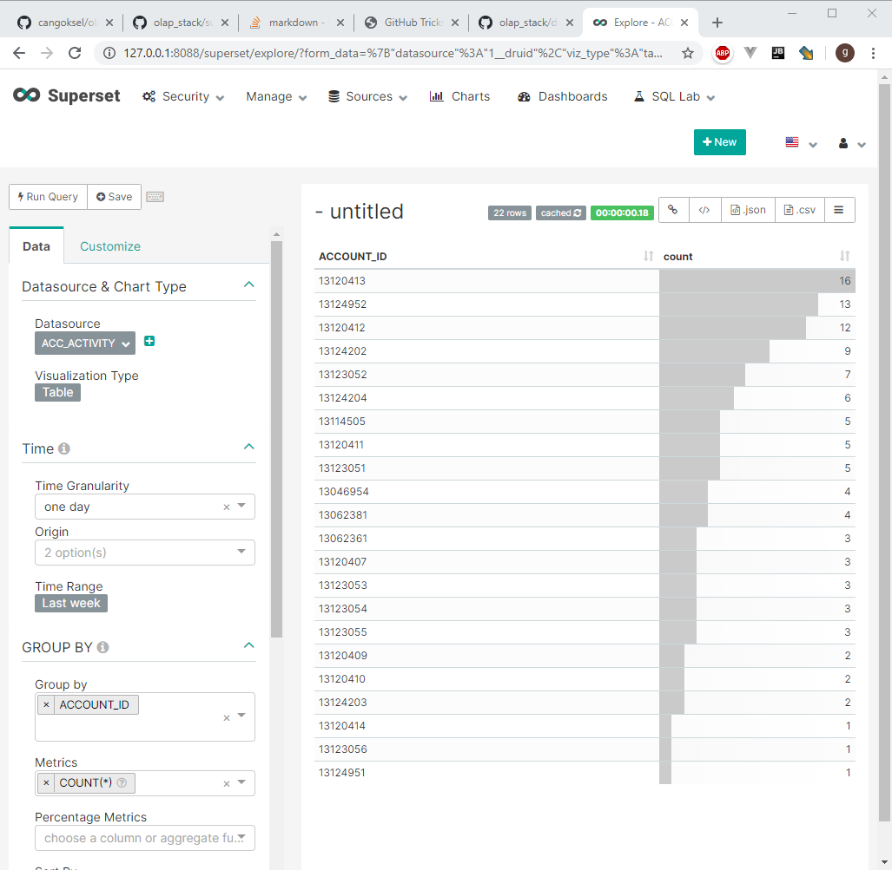

# olap_stack

docker-compose project:
list of apps:

* redis
* postgres
* nifi
* superset
* zqweqwookeeper
* zoonavigator
* zkuiasa
* kafka
* kafdrop
* hadoop hdfs
    * namenode
    * datanode
    * resourcemanager
    * nodemanager
    * historyserver
* druid
   * coordinator
   * broker
   * historical
   * middlemanager
   * router.
   

